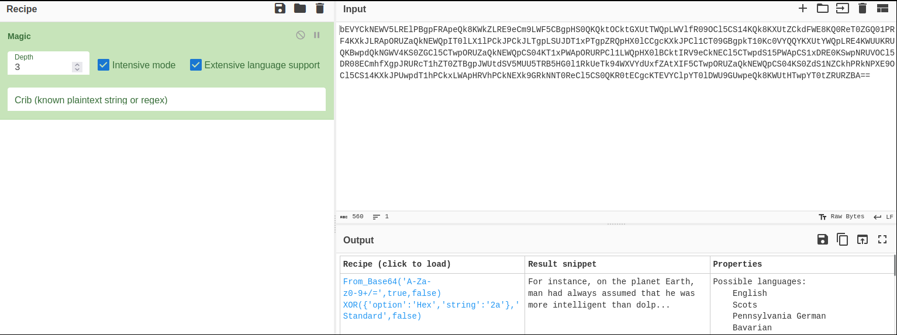
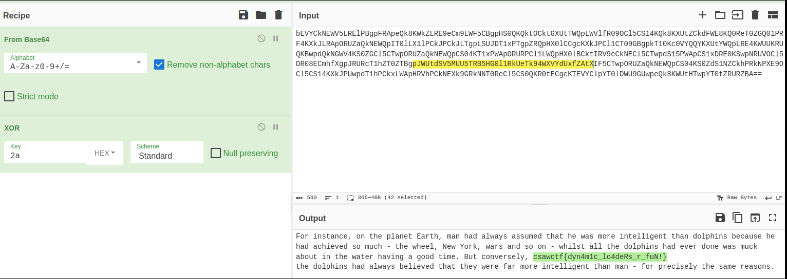

# AndroidDropper
#### Write-up author : [JustKhal](https://github.com/JustKhal)

## DESCRIPTION:
This app does nothing!

dropper.apk sha256sum:
aaf49dcee761d13da52a95f86b7b92596e7b63c14d0a04bce5dd24c7927ecea9

http://misc.csaw.io:3003/

## STEPS:
1. So i don't know if it's intended or not, but i just open the link, and when i opened there's this random/encoded string and from the looks of it it's base64. So i decoded it using CyberChef magic function first.
<p align="center"></p>

2. It looks like it works so click the first recipe to see the full result
<p align="center"></p>

## FLAG:

```
csawctf{dyn4m1c_lo4deRs_r_fuN!}
```