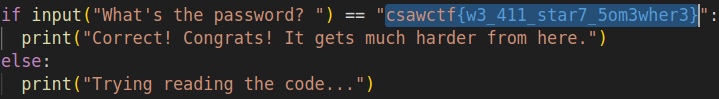

# Baby's First
#### Write-up author : [JustKhal](https://github.com/JustKhal)

## DESCRIPTION:
Reversing means reading code. Read this file, and find the flag!

## STEPS:
1. Just open the python file and *VOILA!*
<p align="center"></p>

## FLAG:

```
csawctf{w3_411_star7_5om3wher3}
```