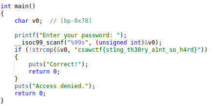

# Baby's Third
#### Write-up author : [Severable](https://github.com/Severable)

## DESCRIPTION:
Babies can't count, but they can do binaries?

(Where did Baby Two go?)

## STEPS:
1. We decompile the executable file using [dogbolt](https://dogbolt.org/) and find the flag in the source code.
<p align="center"></p>
<p align="center"></p>

## FLAG:

```
csawctf{st1ng_th30ry_a1nt_so_h4rd}
```