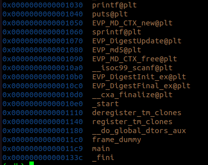
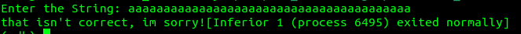
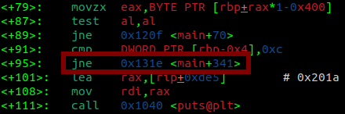
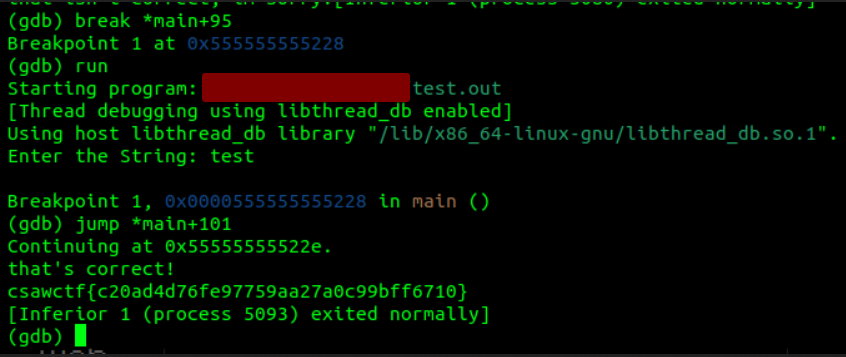

# Rebug 1
#### Write-up author : [JustKhal](https://github.com/JustKhal)

## DESCRIPTION:
Can't seem to print out the flag :( Can you figure out how to get the flag with this binary?

## STEPS:
1. First we open it with gdb, and then see the functions in the program
<p align="center"></p>

2. We see that there's only main function that worth to look at, so we disassemble the main function

3. Since the main function is pretty long, so we tried to run it first and see what the program does
<p align="center"></p>

4. We see that it asks us for an input and then we just gave it a random string, and it gave us an output that our input isn't correct. So now we start to look at the main function, at first skimming through the main function we noticed something interesting.
<p align="center"></p>

5. The program jumps to almost the end of the whole program if DWORD PTR[rbp-0x4] is not equal with 0xc. So our first thought was to bypass that by creating a breakpoint at main+95 and then jump to main+101
<p align="center"></p>


## FLAG:

```
csawctf{c20ad4d76fe97759aa27a0c99bff6710}
```