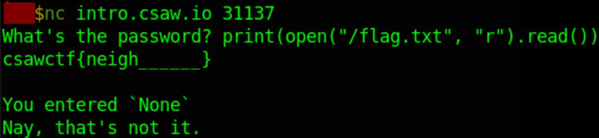

# my_first_pwnie
#### Write-up author : [JustKhal](https://github.com/JustKhal)
## DESCRIPTION:
You must be this high to ride.
Note: flag is in /flag.txt

nc intro.csaw.io 31137

## STEPS:
1. So it only gives us a python code, so we take a loot at the code
```py
try:
  response = eval(input("What's the password? "))
  print(f"You entered `{response}`")
  if response == "password":
    print("Yay! Correct! Congrats!")
    quit()
except:
  pass

print("Nay, that's not it.")
```

2. From we can easily know we just have to do file open since our input is inside eval()
<p align="center"></p>

## FLAG:

```
csawctf{neigh__}
```