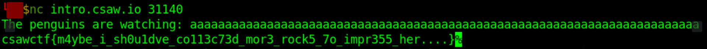

# puffin
#### Write-up author : [JustKhal](https://github.com/JustKhal)
## DESCRIPTION:
Huff, puff, and blow that buffer over

nc intro.csaw.io 31140

## STEPS:
1. From the description of the chall itself, it gives us a hint **buffer overflow**. So we just did a simple fuzzing or long random input
<p align="center"></p>

## FLAG:

```
csawctf{m4ybe_i_sh0u1dve_co113c73d_mor3_rock5_7o_impr355_her....}
```