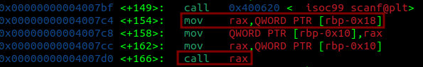
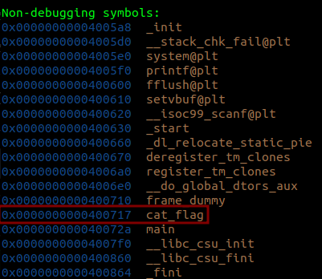
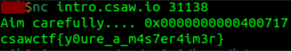

# target_practice
#### Write-up author : [JustKhal](https://github.com/JustKhal)

## DESCRIPTION:
Aim carefully... This pwnie can JUMP!

Connect with:
nc intro.csaw.io 31138

## STEPS:
1. First we open it with gdb and then we dissamble the main function
<p align="center"></p>

2. In the main function we see that there's no function or anything that explicitly call the function that will give us the flag but if we look carefully at the main function it asks us for an input and then the program will call our input
<p align="center"></p>

3. From that we can assume that we just gotta input the address of the flag function to get the flag
<p align="center"></p>

## FLAG:

```
csawctf{y0ure_a_m4s7er4im3r}
```
